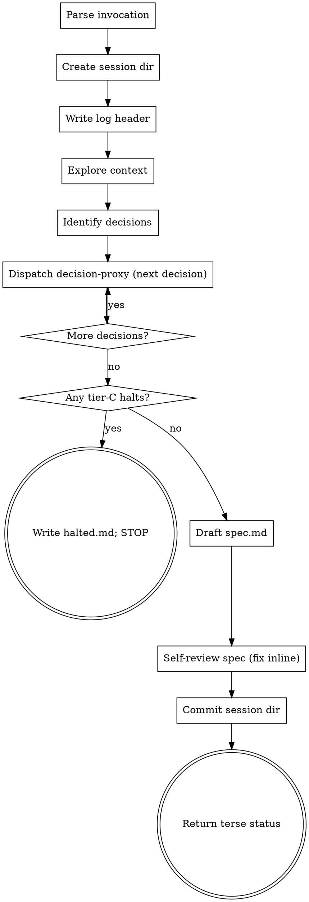

# Brainstorming Ideas Into Designs

Turn an idea into a fully formed design and spec WITHOUT interactive dialogue. The user invoked you and walked away. Instead of asking questions, identify each decision and dispatch the `decision-proxy` subagent to answer it. Log every meaningful decision to `session-log.md`. Write the spec without waiting for user approval.

You are running inside the auto-superpowers plugin. Read `skills/using-auto-superpowers/SKILL.md`, `skills/session-artifacts/SKILL.md`, and `skills/decision-proxy/SKILL.md` before starting.

<HARD-GATE>
Do NOT invoke any implementation skill, write any code, or scaffold any project in this skill. Your only outputs are `session-log.md` and `spec.md` inside the session directory. Implementation is a later stage (writing-plans, executing-plans). This applies to EVERY project regardless of perceived simplicity.

Do NOT proceed to writing-plans if any tier-C decision halted to `halted.md` during this brainstorm.

If `<session-dir>/halted.md` already exists when you start (for example, the caller passed a session dir from a prior halt), do NOT proceed. Return terse status reporting the pre-existing halt and stop. On a resume flow, the caller is responsible for archiving `halted.md` (e.g., renaming it to `halted-resolved-<timestamp>.md`) BEFORE invoking this skill.
</HARD-GATE>

## Anti-Pattern: "This Is Too Simple To Need A Design"

Every project goes through this process. A todo list, a single-function utility, a config change — all of them. "Simple" projects are where unexamined assumptions cause the most wasted work. The design can be short (a few sentences for truly simple projects), but you MUST produce one.

## Checklist

You MUST create a task for each of these items and complete them in order:

1. **Parse invocation** — read task description, flags (`--docs-root`, `--persona`), and determine the session slug
2. **Create or reuse session directory** — If the caller passed an existing session directory path (the `/auto` pipeline driver does this), reuse it and skip creation. Otherwise create `docs/auto-superpowers/sessions/<YYYY-MM-DD-HHMM-slug>/` (follow slug rules in `skills/session-artifacts/SKILL.md`). Detect a pipeline-provided session dir by looking for `SESSION_DIR:` followed by a path in the input prompt, or by checking for an existing `session-log.md` in a directory path the caller named explicitly.
3. **Write or extend session-log.md header** — If `session-log.md` does not yet exist in the session dir, write the full header (task, stop-at, persona skills detected — use `Skill` tool listing to populate). If it already exists (pipeline mode), append a `## Phase: brainstorming` section marker instead; do NOT rewrite the file header, the pipeline driver owned it.
4. **Explore project context** — check files, docs, recent commits (read-only)
5. **Identify the decision list** — enumerate the tier-B/C decisions this brainstorm needs to resolve
6. **Dispatch decision-proxy per decision** — one dispatch per decision, in order, appending a session-log.md entry after each
7. **On any tier-C halt** — write `halted.md`, stop the skill, do not proceed to step 8
8. **Draft the spec** — using the decision answers, write `spec.md` in the session directory
9. **Spec self-review** — placeholder scan, internal consistency, scope, ambiguity (fix inline)
10. **Commit if allowed** — if the session directory is NOT gitignored, stage and commit its contents with the commit trailer defined in `skills/session-artifacts/SKILL.md`. If it IS gitignored, skip the commit entirely and note this in the return status. (Phase 1 `.gitignore` ignores session directories by default.)
11. **Return control** — emit a terse status summary naming the session directory

## Process Flow



**There is no user-approval gate.** The spec is the deliverable. If you feel the urge to ask the user a question, stop and dispatch the decision-proxy instead.

## The Process

**Understanding the idea:**

- Check the current project state first (files, docs, recent commits). Read-only.
- Assess scope. If the request describes multiple independent subsystems, flag it in `session-log.md` and help the user decompose by producing a multi-spec plan (one spec per subsystem). Do not attempt to brainstorm multiple subsystems in a single run.
- Identify the set of tier-B/C decisions this brainstorm needs to resolve before a spec can be written. List them in `session-log.md` before dispatching the first proxy call.

**Dispatching the decision-proxy:**

- One dispatch per decision. Do not batch. Each dispatch is a focused prompt:
  ```
  Question: <one specific decision>
  Options: <list of 2+ options, or "open-ended">
  Task context: <one paragraph>
  Confidence tier: <A|B|C>
  Relevant files: <optional>
  ```
- After each dispatch, append a structured entry to `session-log.md` in the format defined by `skills/session-artifacts/SKILL.md`.
- If the proxy returns `tier_override: C` with low confidence, write `halted.md` and STOP the skill. Do not proceed.

**Sequential vs. parallel dispatch:**

Decisions with semantic dependencies MUST be sequential — if decision B's framing or task context depends on decision A's answer, dispatch A first, wait for its result, then frame B using A's answer. Independent decisions (where one answer does not change another's framing) MAY be dispatched in parallel to save wall-clock time. When in doubt, sequential.

Example — independent, parallel-safe:
- "Which color palette?" and "Which database?" — no overlap.

Example — dependent, must be sequential:
- "Which language?" followed by "Which test runner for that language?" — the second question's options list is different per language.
- "Should output default be NDJSON or array?" followed by decisions whose task-context line references that default — the downstream prompts would be written with a stale assumption otherwise.

If you dispatch in parallel and a later answer contradicts a task-context assumption you embedded in a peer dispatch, note the staleness explicitly in the session-log entry for the affected decision, verify the answer still stands under the corrected context (re-dispatch if it doesn't), and make the spec reflect the authoritative answer.

**Drafting the spec:**

- Write `spec.md` using the decision answers. Structure the document per the normal superpowers spec conventions (summary, goals/non-goals, architecture, components, data flow, error handling, testing). The decision-proxy answers drive the content.
- Include a "Key autonomous decisions" callout at the top of `spec.md` listing 3–7 load-bearing decisions with links into `session-log.md`.
- Scale each section to its complexity: a few sentences if straightforward, up to 200-300 words if nuanced.

**Design for isolation and clarity:**

- Break the system into smaller units with clear boundaries and well-defined interfaces.
- For each unit, answer: what does it do, how do you use it, and what does it depend on?

**Working in existing codebases:**

- Follow existing patterns. Explore before proposing changes.
- Targeted improvements to surrounding code are fine if they serve the current goal. Do not propose unrelated refactoring.

## After the Design

**Writing the spec:**

- Write `spec.md` to the current session directory.
- The spec filename is always `spec.md` inside the session directory — not `YYYY-MM-DD-<topic>-design.md`. The session directory name already encodes the date and topic.

**Spec self-review:**

After writing, look at the spec with fresh eyes:

1. **Placeholder scan:** Any "TBD", "TODO", incomplete sections, or vague requirements? Fix them.
2. **Internal consistency:** Do any sections contradict each other?
3. **Scope check:** Is this focused enough for a single implementation plan, or does it need decomposition into multiple specs?
4. **Ambiguity check:** Could any requirement be interpreted two different ways? Pick one and make it explicit.

Fix any issues inline. No re-review.

**Commit the session directory (conditional):**

Before committing, check whether the session directory is gitignored:

```bash
git check-ignore -q <session-dir>
```

- **Not gitignored (check-ignore returns exit 1):** stage and commit the session directory contents with this message format:

  ```
  auto-superpowers: brainstorm spec for <slug>

  Session: docs/auto-superpowers/sessions/<dir>/
  ```

- **Gitignored (check-ignore returns exit 0):** skip the commit entirely. Do NOT use `git add -f` to force the add — that would violate the privacy-by-default rule in `skills/session-artifacts/SKILL.md`. The session files still exist on disk and are readable by the user; they are simply untracked. Note the skipped commit clearly in the return status so the user knows the files exist but are not in git history.

Users who want session history committed remove `docs/auto-superpowers/sessions/` from `.gitignore` (or use the future `--commit-session-log` flag when Phase 3 ships).

**Return terse status:**

Emit a one-paragraph summary naming the session directory, the spec path, any halts, and a pointer to `/calibrate-proxy` (Phase 3). Do NOT invoke any other skill. This skill's terminal state is "spec committed, status returned."

## Key Principles

- **One decision per proxy dispatch** — never batch
- **Log every tier-B/C decision** — the transcript is the audit trail
- **YAGNI ruthlessly** — cut scope whenever reasonable
- **Explore alternatives** — present 2+ options to the proxy for every non-trivial decision
- **Halt on unresolved tier-C** — never power through
- **Honor user-preferences.md** — hard constraints override skill defaults
